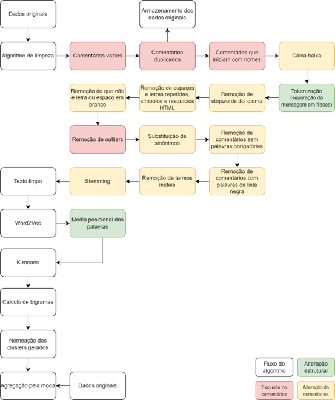

# Inferência automática de assunto em comentários em páginas de redes sociais

Criado e mantido por Daniel Marostica

## Introdução

Aplicação desenvolvida para clusterizar e categorizar comentários de redes sociais. A partir de uma fonte de dados, é treinado um modelo capaz de identificar assuntos distintos entre os comentários.

De forma simplificada, a clusterização sinaliza (aglomera em torno de um centroide) os comentários elegíveis (com o tamanho e o conteúdo permitido). Dentro de cada cluster, são analisados os bigramas mais frequentes e, então, é atribuída uma classificação final para cada um. Isso implica em possíveis erros causados por termos muito frequentes que não possuem sentido claro, mas possuem comentários sinalizados dentro do mesmo cluster.

A técnica de clusterização foi utilizada devido à ausência de comentários classificados. Infelizmente, é mais difícil de controlar o resultado, por isso torna-se interessante criar e atualizar uma base de comentários classificados balanceada para treino supervisionado utilizando tecnologia estado-da-arte: transformers. Além disso, para que fosse possível validar os clusters, seria necessária uma base de validação com uma quantidade significativa de comentários por classe, o que torna o processo complicado de ser atualizado.

Uma falha no desenvolvimento foi não ter sido feito o versionamento dos modelos. É interessante integrar MLFlow para as próximas versões, a fim de salvar tanto o *pickle* do modelo quanto os hiperparâmetros (limites de tamanho dos comentários, número de clusters, dimensões da vetorização, etc. contidos em modules/config.py).

## Modelo

### Pré-processamento

É importante para a clusterização que sinônimos sejam substituídos sempre que possível no arquivo `utils/config.py`. Remover termos desnecessários também.

### Word2Vec + KMeans

Frases de comentários são transformadas em vetores (soma vetorial de cada palavra vetorizada dividida pelo tamanho da frase) e clusterizadas com KMeans. Os clusters são então atribuídos manualmente a labels no arquivo `config.py` de acordo com seus bigramas mais frequentes.

### Manutenção

A manutenção do modelo deverá ser feita observando o output de um processo de treinamento. Com dados novos, caso surja um novo assunto, poderá surgir também um novo bigrama importante que deve ser atribuído a uma (nova ou não) classificação final.

### Módulos

- config.py: atribuição manual de clusters de acordo com o output da NMF. Ao fim da inferência, são exibidos no terminal termos que não possuem atribuição. Adicioná-los ao arquivo, se adequados.
- cleaner.py: limpeza e tratamento de dados utilizada em todas as etapas.
- GensimEstimator.py: SKLearn wrapper para utilizar Word2Vec em pipelines.

**Treino**

O treino deve ser realizado localmente quando for necessário (por exemplo, para adicionar os novos termos exibidos no terminal da inferência).
